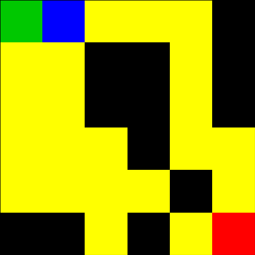

# Maze_Laberinto_6x6

### README.md
```markdown
# Maze Laberinto 6x6

Reinforcement learning project comparing DQN and Dyna-Q in a 6x6 maze.

## Installation
1. Clone the repo:
   ```bash
   git clone https://github.com/ushio2580/Maze_Laberinto_6x6.git
   cd Maze_Laberinto_6x6
   ```
2. Install dependencies:
   ```bash
   pip install gym torch imageio matplotlib numpy
   ```

## Usage
1. Open `Maze_Laberinto_6x6.ipynb` in Google Colab or Jupyter.
2. Run all cells to train and test agents.
3. GIFs are saved in `dqn_training_gifs/`, `dqn_test_gifs/`, etc.

## Results
*(Update after running)*
- 
-  
-  


- **DQN**: Success Rate: 100%, Avg Steps: 10.00

-  
-  
-  
- **Dyna-Q**: Success Rate: 100%, Avg Steps: 10.00

## License
MIT License
```

### Steps
1. **Run Notebook**: Execute in Colab to generate results and GIFs.
2. **Upload**: Push `Maze_Laberinto_6x6.ipynb` and GIF folders to your repo.
3. **Add README**: Create `README.md` in the repo root with the above content.
